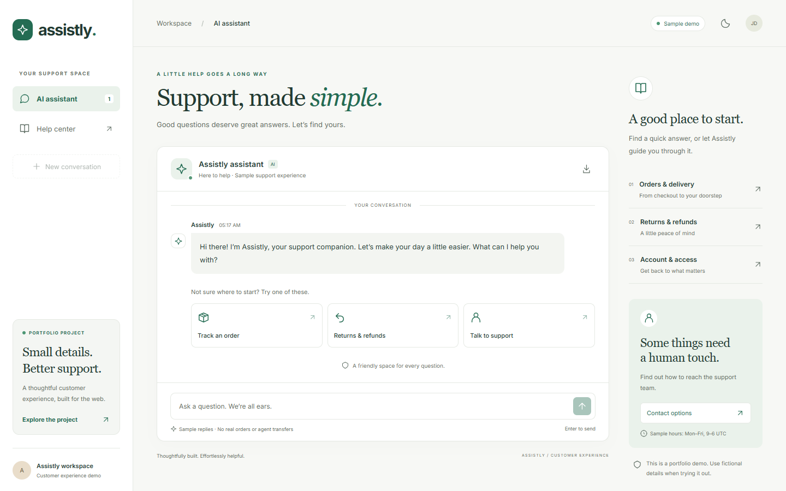

# Assistly — Support, made simple.

A polished customer support portfolio project, built with React and Flask. The original AI chatbot has been upgraded into a complete support workspace with custom branding, responsive layouts, a searchable help center, light and dark themes, saved conversations, and transcript downloads.

## Preview



## Start here

- **No-install preview:** build the frontend, then run `python scripts/package.py` from the repository root. Double-click the generated `portfolio/preview.html`. This self-contained file runs the sample support experience without credentials or a server. Generated preview files and ZIPs are kept out of Git.
- **Portfolio presentation:** open `portfolio/case-study.html` for the editable case study, screenshots, and project overview. Its interactive demo link works after generating the preview.
- **Fiverr copy:** use `portfolio/FIVERR-COPY.md`. The project is presented as a concept/demo with no invented client results.
- **Gallery images:** `portfolio/thumbnail.png`, `cover.png`, `desktop-light.png`, `desktop-dark.png`, `conversation.png`, `mobile.png`, and `help-center.png`.

## Run the editable project

Requires Node.js/npm and Python 3.10 or newer.

```powershell
python -m venv .venv
.venv\Scripts\python.exe -m pip install -r requirements.txt
cd frontend
npm ci
npm run build
cd ..
.venv\Scripts\python.exe app.py
```

Open http://127.0.0.1:5000. With no API key, the UI uses clearly labeled scripted sample replies. The backend serves the compiled React app and a health endpoint.

For frontend development, run the Flask server in one terminal, then `npm start` from `frontend` in another. The React development server proxies `/api` to Flask on port 5000. For a separate API host, set `REACT_APP_API_URL` in `frontend/.env.local` and rebuild. That URL is public configuration; never place an API key there.

## Optional live AI

Copy `.env.example` to `.env` and set `GEMINI_API_KEY` on the server. The legacy `GOOGLE_API_KEY` name is also supported. Choose a model available to your account with `GEMINI_MODEL`. The default is `gemini-3.8-flash`, following the current [Gemini API reference](https://ai.google.dev/api/generate-content). The model is configurable because provider availability can change.

Restart Flask. A configured server enables live mode in the UI; this does not guarantee the provider is reachable. Service failures show a retry option and an explicit switch to sample mode. The standalone preview always uses sample mode.

## Project structure

```text
app.py                     Stateless Gemini API + frontend serving
requirements.txt           Minimal Python dependencies
tests/test_api.py          API validation/isolation/error checks
frontend/src/App.js        Support workspace and interactions
frontend/src/App.css       Responsive themes and visual system
frontend/src/content.js    Editable sample topics, articles, replies
frontend/public/brand.svg  Editable brand mark
portfolio/                 Presentation, copy, and export assets
scripts/package.py         Regenerate preview and download package
```

## Validation

```powershell
python -m unittest discover -s tests -v
cd frontend
npm test -- --watchAll=false --runInBand
npm run build
```

The API has no global conversation history. Each request sends bounded history from its own browser. Chats and theme preference are stored in that browser's local storage. A new conversation clears the current browser transcript. Live messages go to Google's Gemini API; avoid sensitive data. Sample mode makes no AI requests.

## Honest scope

This is a portfolio demonstration for a fictional store. Shipping policies, return rules, and support hours are sample content. There is no order database, authentication, actual refund processing, email sending, ticketing, or live agent transfer. No performance gains or commercial client outcomes are claimed. Before public production use, add appropriate authentication, rate limits, monitoring, a production WSGI server, and real business integrations.

The existing Create React App toolchain is retained to preserve the project. Its upstream packages include legacy/deprecated dependencies; a tooling migration is a future maintenance task, separate from this portfolio upgrade.
